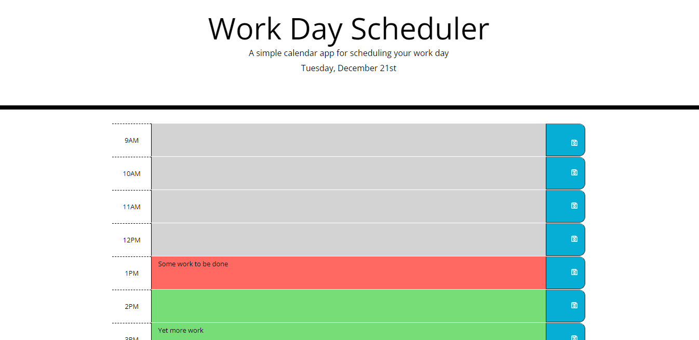

# Work Day Scheduler

## Description
This is a single page application built with HTML, CSS, and JavaScript, designed to help a user to keep track of what needs to be done at which hours of the day. The app uses moment.js to color code time blocks as the day goes on. It uses local storage to save tasks entered.

## Usage

Screenshot

The current day is displayed at the top of the page. The user can see what hours of the day have past, which hour they're currently on, and which hours have yet to pass, with color coding. Users can enter what needs to be done at which hour of the day in the text area for that hour. When the save button at the end of each column is clicked, the text they've entered will persist in local storage. Every minute the current hour of the day is checked so that the colors will accurately represent the current hour of the day whether or not the user has refreshed the page.

### Link to deployed application
https://soundproofboot.github.io/work-day-scheduler/

## Credits
Starter HTML and CSS provided by U of M bootcamp.

#### Third-party APIs used
Bootstrap
https://getbootstrap.com/
Jquery
https://jquery.com/
Moment.js
https://momentjs.com/
